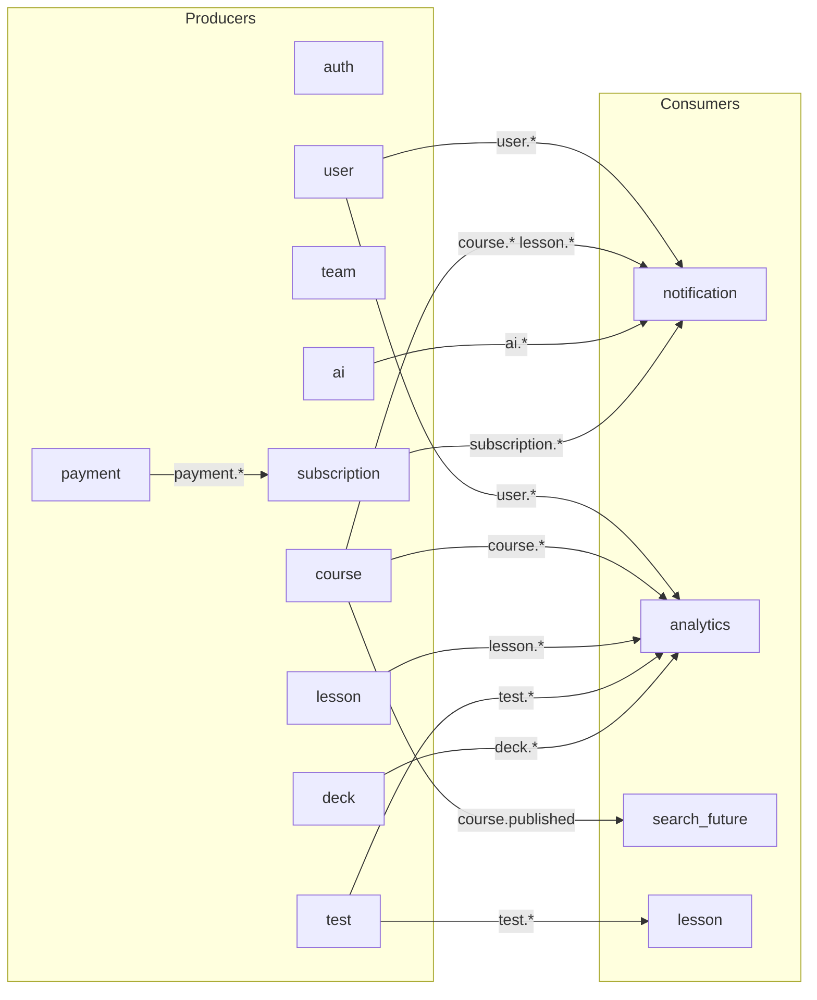

# Kafka messaging catalog (`mindlet-api`)

Single reference for **Kafka traffic between Mindlet microservices**: synchronous **Commands** (request/reply) and asynchronous **Events** (publish/subscribe). Planned rows describe the target architecture aligned with [bounded contexts](../../docs/02-domain-model.md).

---

## Conventions

| Topic | Detail |
|-------|--------|
| **Transport** | NestJS microservices over Kafka: [`create-client.config.ts`](../libs/common/src/configs/create-client.config.ts), [`micro-service-application.config.ts`](../libs/common/src/configs/micro-service-application.config.ts). |
| **Envelope** | Every outbound message is wrapped by [`ClientService`](../libs/common/src/modules/client/client.service.ts) as `{ data, traceId?, timestamp, messageId, expiresAt? }` — see [`MessagePayload<T>`](../libs/common/src/types/message.payload.ts). RPC handlers unwrap `data` via `@DataPayload`. |
| **Commands** | `@MessagePattern` + `client.send()` / `sendAndReturnPromise()` — one consumer replies; caller waits. |
| **Events** | `@EventPattern` + `client.emit()` — zero or many consumers; no reply (planned usage). |
| **Pattern / topic naming** | Prefer `<context>.<resource>.<verb>` (e.g. `course.enrollment.created`). Use stable enums under `libs/common/src/enums/messages/` when adding commands. |
| **Identity** | Each service uses a dedicated Kafka `clientId` and consumer `groupId` — see [Services map](#services-map). |

### Reliability & versioning (guidelines)

- **Tracing**: Propagate `traceId` from the envelope for cross-service logs.
- **Idempotency**: Consumers should dedupe by `messageId` when processing events at-least-once.
- **Breaking payload changes**: Introduce a new pattern suffix (e.g. `.v2`) or a new topic; avoid silent breaks.
- **DLQ / retries**: Policy not finalized — treat as a roadmap item when moving events to production Kafka.

### Out of scope

- **Real-time collaborative editing** (Yjs / CRDT) uses WebSockets, not Kafka — see [Collaboration](../../docs/features/12-collaboration.md).
- **Full JSON Schemas** for payloads live next to DTOs in `libs/types` / service modules; this doc lists **key fields** only.

---

## Services map

Kafka client / consumer IDs from [`services.config.ts`](../libs/common/src/configs/services.config.ts). Ownership aligns with [Domain model](../../docs/02-domain-model.md).

| Service | Kafka `clientId` | Consumer group | Owns (bounded context) |
|---------|------------------|----------------|-------------------------|
| `admin` | `admin-client` | `admin-consumer` | Admin ops (future) |
| `auth` | `auth-client` | `auth-consumer` | `Account`, `Credentials`, `Session`, JWT issuance & validation |
| `user` | `user-client` | `user-consumer` | `User`, `UserSettings` |
| `course` | `course-client` | `course-consumer` | `Course`, `Enrollment` |
| `lesson` | `lesson-client` | `lesson-consumer` | `Lesson`, `Theory`, `LessonProgress`, editor session |
| `test` | `test-client` | `test-consumer` | `Test`, `Question`, `Attempt` |
| `deck` | `deck-client` | `deck-consumer` | `Deck`, `Card`, `Review`, `MemoryState` |
| `team` | `team-client` | `team-consumer` | `Team`, `TeamMember`, `Invite` |
| `ai` | `ai-client` | `ai-consumer` | `AIJob`, drafts |
| `notification` | `notification-client` | `notification-consumer` | Delivery channels, preferences |
| `payment` | `payment-client` | `payment-consumer` | Stripe / payments |
| `subscription` | `subscription-client` | `subscription-consumer` | Plans, subscriptions |
| `analytics` | `analytics-client` | `analytics-consumer` | Read models, aggregates |

---

## Commands (request / reply)

Grouped by **owning service** (the handler). **`Status`**: `implemented` = handler exists in repo; `planned` = not wired yet.

### `auth`

| Pattern | Producer(s) | Consumer | Request (summary) | Response (summary) | When / why | Status |
|---------|-------------|----------|-------------------|--------------------|------------|--------|
| `auth.user.validate` | HTTP stacks using [`AuthGuard`](../libs/common/src/modules/auth-guards/auth.guard.ts) / [`OptionalAuthGuard`](../libs/common/src/modules/auth-guards/optional-auth.guard.ts) (`Services.AUTH` client) | `auth` | `{ accessToken }` | `AuthenticatedUser` | Validate JWT + active session on protected routes | **implemented** — [`AuthController`](../apps/auth/src/auth/auth.controller.ts) |

### `user`

| Pattern | Producer(s) | Consumer | Request (summary) | Response (summary) | When / why | Status |
|---------|-------------|----------|-------------------|--------------------|------------|--------|
| `user.create` | `auth` [`CredentialsService`](../apps/auth/src/credentials/credentials.service.ts) | `user` | `CreateUserDto` (plaintext `password`) | `UserEntity` | Register — `user` bcrypt-hashes password and creates `User` + `UserPrivateData` (nested write) | **implemented** — [`UserMessageController`](../apps/user/src/user/user-message.controller.ts) |
| `user.get_by_email` | `auth` [`CredentialsService`](../apps/auth/src/credentials/credentials.service.ts) | `user` | `{ email }` | `UserEntity` | Login lookup | **implemented** — [`UserMessageController`](../apps/user/src/user/user-message.controller.ts) |
| `user.get_by_id` | `auth` (`AuthService.generateTokens`, flows needing full user projection) | `user` | `{ userId }` | `UserEntity` | Load profile by id | **implemented** — same file |
| `user.password.verify` (`UserMessage.VERIFY_PASSWORD`) | `auth` [`CredentialsService`](../apps/auth/src/credentials/credentials.service.ts) | `user` | `{ userId, password }` | `true` on success; throws on invalid | Login password check; `auth` wraps in try/catch → `Invalid credentials` | **implemented** — [`UserPasswordMessageController`](../apps/user/src/user-password/user-password-message.controller.ts) |
| `user.email.mark_verified` | `auth` [`EmailVerificationService`](../apps/auth/src/email-verification/email-verification.service.ts) | `user` | `{ userId, email }` | `UserEntity` | Sets `emailVerifiedAt` | **implemented** — [`UserMessageController`](../apps/user/src/user/user-message.controller.ts) |
| `user.password.update` (`UserPrivateMessage.UPDATE`) | `auth` [`PasswordResetService`](../apps/auth/src/password-reset/password-reset.service.ts) | `user` | `{ userId, password }` (plaintext new password) | `UserPrivateDataEntity` | After reset token consume — `user` hashes before persist | **implemented** — [`UserPrivateMessageController`](../apps/user/src/user-private-data/user-private-message.controller.ts) |
| `user.update` | `user`, `auth` | `user` | Patch DTO | `UserEntity` | Profile/settings update | **planned** |
| `user.delete` | `user`, `auth` | `user` | `{ userId }` | ack | GDPR / account deletion | **planned** |

### `course`

_Feature reference: [Courses](../../docs/features/04-courses.md), [Course & lesson](../../docs/features/05-course-and-lesson.md)._

| Pattern | Producer(s) | Consumer | Request (summary) | Response (summary) | When / why | Status |
|---------|-------------|----------|-------------------|--------------------|------------|--------|
| `course.create` | `course` (HTTP), `team` | `course` | Owner, metadata | `Course` | New course | **planned** |
| `course.update` | `course` | `course` | id, patch | `Course` | Edit metadata | **planned** |
| `course.delete` | `course` | `course` | id | ack | Soft-delete | **planned** |
| `course.publish` | `course` | `course` | id | `Course` | Publish + validations | **planned** |
| `course.get_by_id` | `lesson`, `notification`, `analytics` | `course` | id | `Course` | Cross-service read | **planned** |
| `course.list` | `search`, `analytics` | `course` | filters | list | Query | **planned** |
| `course.enrollment.create` | `course`, `user` | `course` | user, course | `Enrollment` | Join course | **planned** |
| `course.enrollment.cancel` | `course`, `user` | `course` | enrollment id | ack | Leave / drop | **planned** |

### `lesson`

| Pattern | Producer(s) | Consumer | Request (summary) | Response (summary) | When / why | Status |
|---------|-------------|----------|-------------------|--------------------|------------|--------|
| `lesson.create` | `course` | `lesson` | course id, draft | `Lesson` | Add lesson | **planned** |
| `lesson.update` | `lesson` | `lesson` | id, patch | `Lesson` | Edit structure | **planned** |
| `lesson.delete` | `lesson` | `lesson` | id | ack | Remove lesson | **planned** |
| `lesson.publish` | `lesson` | `lesson` | id | `Lesson` | Publish lesson | **planned** |
| `lesson.get_by_id` | `course`, `test`, `deck` | `lesson` | id | `Lesson` | Cross-read | **planned** |
| `lesson.theory.upsert` | `lesson` | `lesson` | theory payload | `Theory` | Save theory body | **planned** |
| `lesson.progress.mark_complete` | `lesson` | `lesson` | enrollment, lesson | `LessonProgress` | Manual complete when no required blocks | **planned** |

### `test`

_Feature reference: [Tests & decks](../../docs/features/07-tests-and-decks.md), [Grading](../../docs/features/17-grading.md)._

| Pattern | Producer(s) | Consumer | Request (summary) | Response (summary) | When / why | Status |
|---------|-------------|----------|-------------------|--------------------|------------|--------|
| `test.create` | `lesson` | `test` | lesson id, config | `Test` | Attach quiz block | **planned** |
| `test.update` | `lesson` | `test` | id, patch | `Test` | Edit quiz | **planned** |
| `test.delete` | `lesson` | `test` | id | ack | Remove quiz | **planned** |
| `test.question.upsert` | `lesson` | `test` | test id, question | `Question` | CRUD question | **planned** |
| `test.attempt.start` | `course` / gateway | `test` | user, test | `Attempt` | Begin quiz session | **planned** |
| `test.attempt.submit` | `course` / gateway | `test` | attempt id, answers | `Attempt` | Submit for grading | **planned** |
| `test.attempt.grade_manual` | `course` (teacher) | `test` | attempt id, scores | `Attempt` | Manual grading | **planned** |

### `deck`

_Feature reference: [Tests & decks](../../docs/features/07-tests-and-decks.md), [Spaced repetition](../../docs/features/11-spaced-repetition.md)._

| Pattern | Producer(s) | Consumer | Request (summary) | Response (summary) | When / why | Status |
|---------|-------------|----------|-------------------|--------------------|------------|--------|
| `deck.create` | `lesson` | `deck` | lesson id, meta | `Deck` | Attach deck block | **planned** |
| `deck.update` | `lesson` | `deck` | id, patch | `Deck` | Edit deck | **planned** |
| `deck.delete` | `lesson` | `deck` | id | ack | Remove deck | **planned** |
| `deck.card.upsert` | `lesson`, `ai` | `deck` | deck id, card | `Card` | CRUD cards | **planned** |
| `deck.review.submit` | `course` / SRS worker | `deck` | review payload | `Review`, `MemoryState` | Record swipe / FSRS update | **planned** |
| `deck.next_due` | `deck`, scheduler | `deck` | user id | due cards | Study queue | **planned** |

### `ai`

_Feature reference: [AI assistant](../../docs/features/10-ai-assistant.md)._

| Pattern | Producer(s) | Consumer | Request (summary) | Response (summary) | When / why | Status |
|---------|-------------|----------|-------------------|--------------------|------------|--------|
| `ai.job.enqueue` | `lesson`, `deck`, `test` | `ai` | job type, input refs | `AIJob` | Queue generation | **planned** |
| `ai.job.cancel` | gateway | `ai` | job id | ack | Cancel job | **planned** |
| `ai.job.get` | gateway | `ai` | job id | `AIJob` | Poll status | **planned** |

### `notification`

_Feature reference: [Notifications](../../docs/features/13-notifications.md)._

| Pattern | Producer(s) | Consumer | Request (summary) | Response (summary) | When / why | Status |
|---------|-------------|----------|-------------------|--------------------|------------|--------|
| `notification.send-two-factor` | `auth` / flows requesting 2FA | `notification` | user id, code, provider | ack | Deliver OTP | **implemented** — [`TwoFactorController`](../apps/notification/src/two-factor/two-factor.controller.ts) |
| `email.send-mail-confirmation` | `auth` / onboarding | `notification` | user id, code | ack | Email verification mail | **implemented** — [`MailConfirmationController`](../apps/notification/src/mail-confirmation/mail-confirmation.controller.ts) |
| `notification.send.generic` | multiple | `notification` | template, channels, payload | ack | Generic transactional send | **planned** |
| `notification.preferences.get` | gateway | `notification` | user id | preferences | Load prefs | **planned** |
| `notification.preferences.update` | gateway | `notification` | patch | preferences | Update prefs | **planned** |

### `team`

_Feature reference: [Teams](../../docs/features/08-teams.md)._

| Pattern | Producer(s) | Consumer | Request (summary) | Response (summary) | When / why | Status |
|---------|-------------|----------|-------------------|--------------------|------------|--------|
| `team.create` | gateway | `team` | owner, meta | `Team` | New team | **planned** |
| `team.update` | gateway | `team` | id, patch | `Team` | Edit team | **planned** |
| `team.delete` | gateway | `team` | id | ack | Delete team | **planned** |
| `team.member.add` | gateway | `team` | team, user, role | `TeamMember` | Add member | **planned** |
| `team.member.remove` | gateway | `team` | membership id | ack | Remove | **planned** |
| `team.role.upsert` | gateway | `team` | role dto | `TeamRole` | Custom roles | **planned** |
| `team.invite.create` | gateway | `team` | email, role | `Invite` | Send invite | **planned** |
| `team.invite.accept` | gateway | `team` | token, user | `TeamMember` | Accept | **planned** |
| `team.invite.revoke` | gateway | `team` | invite id | ack | Revoke | **planned** |

### `payment`

_Feature reference: [Subscription & payments](../../docs/features/16-subscription-and-payments.md)._

| Pattern | Producer(s) | Consumer | Request (summary) | Response (summary) | When / why | Status |
|---------|-------------|----------|-------------------|--------------------|------------|--------|
| `payment.checkout.create` | `subscription`, gateway | `payment` | plan, owner | checkout session | Start Stripe checkout | **planned** |
| `payment.intent.create` | `subscription` | `payment` | amount, metadata | intent | Off-session payment | **planned** |
| `payment.refund.create` | admin | `payment` | payment id | refund | Support refund | **planned** |

### `subscription`

| Pattern | Producer(s) | Consumer | Request (summary) | Response (summary) | When / why | Status |
|---------|-------------|----------|-------------------|--------------------|------------|--------|
| `subscription.get` | gateway, `payment` | `subscription` | owner | `Subscription` | Read state | **planned** |
| `subscription.create` | gateway | `subscription` | plan, owner | `Subscription` | New subscription | **planned** |
| `subscription.cancel` | gateway | `subscription` | id | ack | Cancel at period end | **planned** |
| `subscription.change_plan` | gateway | `subscription` | id, plan | `Subscription` | Upgrade/downgrade | **planned** |

### `analytics`

_Feature reference: [Analytics](../../docs/features/15-analytics.md)._

| Pattern | Producer(s) | Consumer | Request (summary) | Response (summary) | When / why | Status |
|---------|-------------|----------|-------------------|--------------------|------------|--------|
| `analytics.report.get` | admin gateway | `analytics` | query | report | Ad-hoc reporting API | **planned** |

> Most analytics ingestion should prefer **events** (below) over synchronous commands.

---

## Events (publish / subscribe)

Fire-and-forget topics for domain lifecycle and integrations. **`Status`**: all **planned** until `@EventPattern` handlers and `emit()` publishers exist.

### Overview diagram

### Event catalog

| Topic | Producer | Consumer(s) | Payload (key fields) | When / why | Feature docs |
|-------|------------|---------------|----------------------|------------|--------------|
| `account.registered` | `auth` | `notification`, `analytics` | `accountId`, `email` | Post signup workflows | [Auth](../../docs/features/01-auth.md) |
| `account.email.verified` | `auth` | `notification`, `analytics` | `userId` | Confirm verification | [Auth](../../docs/features/01-auth.md) |
| `account.password.changed` | `auth` | `notification` | `userId` | Security notice | [Auth](../../docs/features/01-auth.md) |
| `account.locked` | `auth` | `notification` | `userId`, reason | Brute-force / admin lock | [Auth](../../docs/features/01-auth.md) |
| `session.started` | `auth` | `analytics` | `userId`, session id | Login funnel | [Auth](../../docs/features/01-auth.md) |
| `session.ended` | `auth` | `analytics` | `userId`, session id | Logout / expiry | [Auth](../../docs/features/01-auth.md) |
| `user.created` | `user` | `notification`, `analytics`, `search` | `userId`, names, email | Registration / search index | [Profile & settings](../../docs/features/02-profile-and-settings.md) |
| `user.updated` | `user` | `analytics`, `search` | `userId`, changed fields | Index update | [Profile & settings](../../docs/features/02-profile-and-settings.md) |
| `user.deleted` | `user` | `analytics`, `notification` | `userId`, `at` | GDPR / cleanup | [Profile & settings](../../docs/features/02-profile-and-settings.md) |
| `team.created` | `team` | `analytics` | `teamId` | Org analytics | [Teams](../../docs/features/08-teams.md) |
| `team.member.joined` | `team` | `notification`, `analytics` | `teamId`, `userId` | Welcome / metrics | [Teams](../../docs/features/08-teams.md) |
| `team.member.left` | `team` | `analytics` | `teamId`, `userId` | Roster change | [Teams](../../docs/features/08-teams.md) |
| `team.invite.sent` | `team` | `notification` | invite id, email | Email invite | [Teams](../../docs/features/08-teams.md) |
| `team.invite.accepted` | `team` | `notification`, `analytics` | `teamId`, `userId` | Join complete | [Teams](../../docs/features/08-teams.md) |
| `team.invite.expired` | `team` | `analytics` | invite id | Funnel | [Teams](../../docs/features/08-teams.md) |
| `course.published` | `course` | `notification`, `analytics`, `search` | `courseId` | Notify subscribers / index | [Courses](../../docs/features/04-courses.md) |
| `course.archived` | `course` | `analytics`, `search` | `courseId` | Catalog update | [Courses](../../docs/features/04-courses.md) |
| `course.enrollment.created` | `course` | `notification`, `analytics` | `enrollmentId`, `userId` | Welcome to course | [Course & lesson](../../docs/features/05-course-and-lesson.md) |
| `course.enrollment.completed` | `course` | `notification`, `analytics` | `enrollmentId` | Certificate / badge | [Course & lesson](../../docs/features/05-course-and-lesson.md) |
| `lesson.published` | `lesson` | `analytics` | `lessonId`, `courseId` | Content freshness | [Course & lesson](../../docs/features/05-course-and-lesson.md) |
| `lesson.completed` | `lesson` | `course`, `analytics` | `lessonId`, `enrollmentId` | Progress aggregation | [Course & lesson](../../docs/features/05-course-and-lesson.md) |
| `lesson.theory.updated` | `lesson` | `analytics` | `lessonId` | Editor analytics | [MD editor](../../docs/features/06-md-editor.md) |
| `test.attempt.submitted` | `test` | `lesson`, `analytics` | `attemptId`, scores | Unlocks next blocks | [Tests & decks](../../docs/features/07-tests-and-decks.md) |
| `test.attempt.graded` | `test` | `lesson`, `notification`, `analytics` | `attemptId`, `passed` | Lesson progress / notify teacher | [Grading](../../docs/features/17-grading.md) |
| `deck.review.submitted` | `deck` | `lesson`, `analytics` | `reviewId`, FSRS state | Lesson completion / SRS metrics | [Spaced repetition](../../docs/features/11-spaced-repetition.md) |
| `deck.card.due` | `deck` (scheduler) | `notification` | `userId`, due batch | Reminder emails/push | [Notifications](../../docs/features/13-notifications.md) |
| `ai.job.completed` | `ai` | `lesson`, `deck`, `test`, `notification` | `jobId`, output refs | Merge drafts / notify | [AI assistant](../../docs/features/10-ai-assistant.md) |
| `ai.job.failed` | `ai` | `notification`, `analytics` | `jobId`, error | User retry / ops | [AI assistant](../../docs/features/10-ai-assistant.md) |
| `payment.succeeded` | `payment` | `subscription`, `notification`, `analytics` | `paymentId`, amount | Activate entitlements | [Subscription & payments](../../docs/features/16-subscription-and-payments.md) |
| `payment.failed` | `payment` | `subscription`, `notification` | `paymentId`, reason | Dunning | [Subscription & payments](../../docs/features/16-subscription-and-payments.md) |
| `payment.refunded` | `payment` | `subscription`, `analytics` | `paymentId` | Revenue adjustment | [Subscription & payments](../../docs/features/16-subscription-and-payments.md) |
| `subscription.activated` | `subscription` | `user`, `team`, `analytics` | `subscriptionId` | Feature gates | [Subscription & payments](../../docs/features/16-subscription-and-payments.md) |
| `subscription.renewed` | `subscription` | `analytics` | `subscriptionId` | MRR tracking | [Subscription & payments](../../docs/features/16-subscription-and-payments.md) |
| `subscription.canceled` | `subscription` | `notification`, `analytics` | `subscriptionId` | Churn | [Subscription & payments](../../docs/features/16-subscription-and-payments.md) |
| `subscription.past_due` | `subscription` | `notification` | `subscriptionId` | Payment reminder | [Subscription & payments](../../docs/features/16-subscription-and-payments.md) |

**Notifications service** does not emit domain events by design — it **consumes** events and sends email/push/in-app messages.

**Analytics** consumes most lifecycle events and typically **does not publish** business topics (only optional internal compaction topics — out of scope here).

**Search** indexer row references a future consumer once [Search](../../docs/features/09-search.md) is implemented.

---

## Related documentation

| Doc | Purpose |
|-----|---------|
| [Domain model](../../docs/02-domain-model.md) | Entities per service |
| [Roles & permissions](../../docs/03-roles-and-permissions.md) | Who may trigger commands |
| [Open questions](../../docs/open-questions.md) | Product/engineering decisions |
| Feature specs (`docs/features/*.md`) | Per-domain behaviour |
